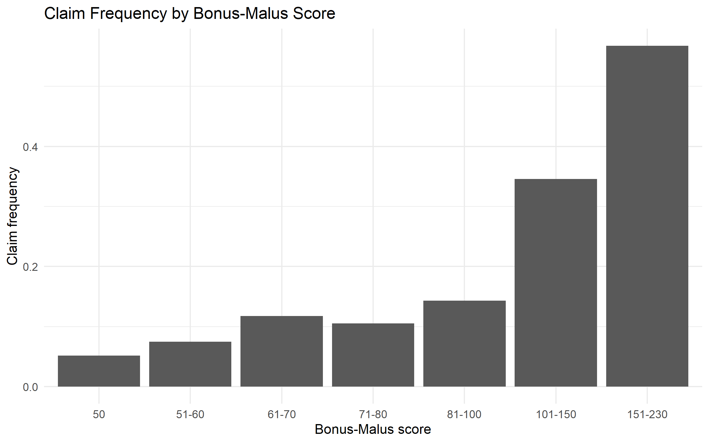
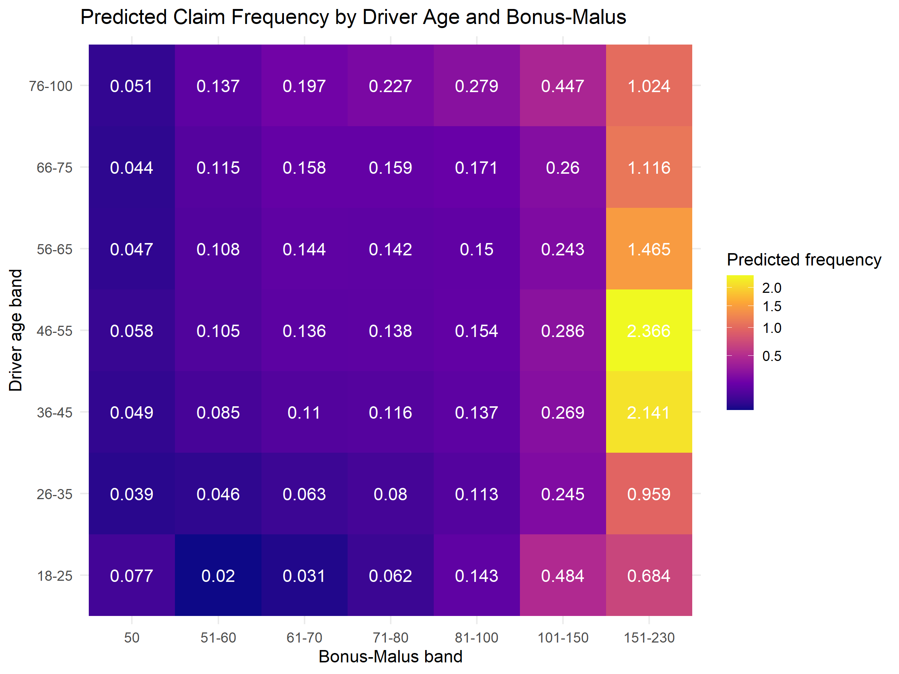
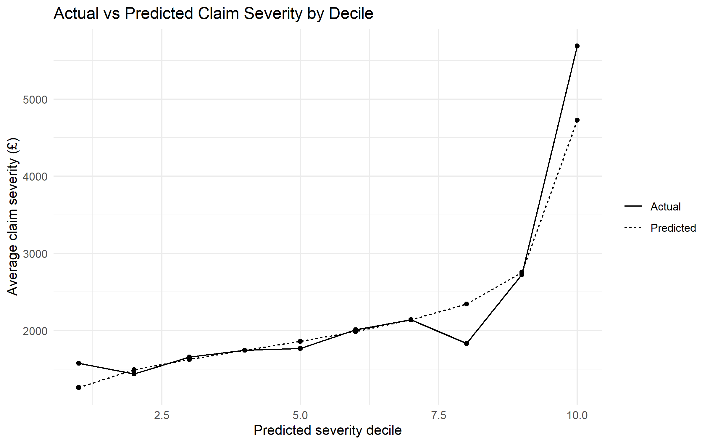
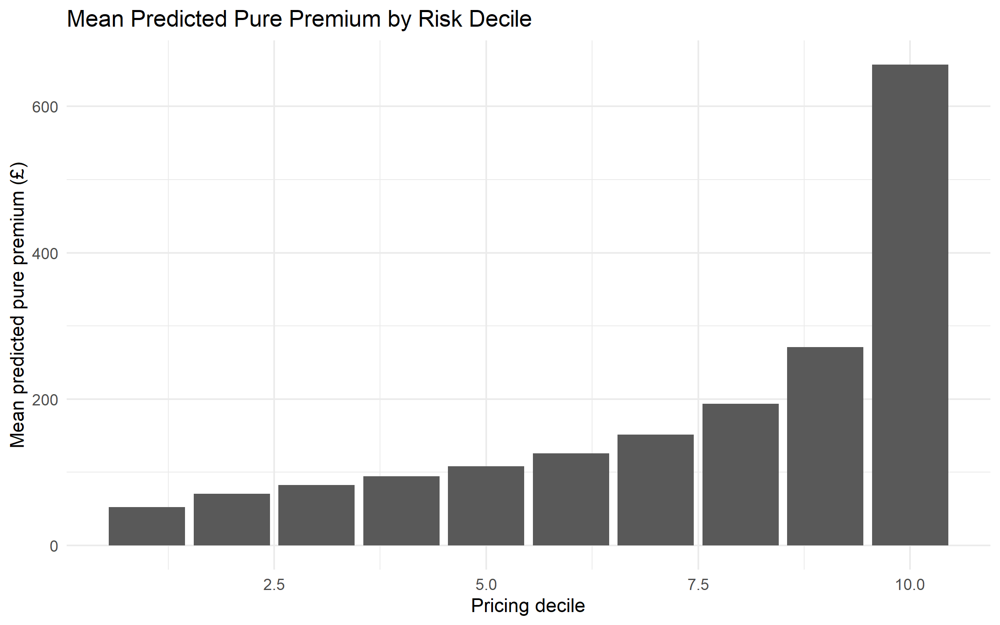

# Motor Insurance Pricing Model

An actuarial motor insurance pricing project using French Motor Third Party Liability (MTPL) data.

The project develops a frequency–severity pricing model, investigates important insurance risk factors, introduces nonlinear effects and interactions, and evaluates the resulting pricing model on held-out test data.

## Project Overview

The objective is to build a simplified actuarial pricing framework for motor insurance.

The modelling approach separates expected claim cost into two components:

1. **Claim frequency** — how often claims occur.
2. **Claim severity** — the average cost of a claim conditional on a claim occurring.

The two components are then combined to estimate expected annual claim cost:

**Pure premium = expected annual claim frequency × expected claim severity**

Illustrative commercial loadings are subsequently applied to convert the pure premium into a commercial premium.

The project focuses on demonstrating the modelling process used in insurance pricing rather than producing a real-world market premium.

---

## Dataset

The project uses the **French Motor Third Party Liability (MTPL)** dataset distributed through the `CASdatasets` project.

The data contains policy-level information such as:

* Driver age
* Vehicle age
* Vehicle power
* Bonus-Malus score
* Vehicle brand
* Fuel type
* Geographic area
* Population density
* Region
* Policy exposure
* Number of claims

A separate severity dataset contains individual claim amounts.

The dataset contains approximately **678,000 policies** and **26,000 recorded claims**, providing a large portfolio for modelling claim frequency and severity.

The raw `.RData` file is **not included in this repository**. It is stored locally and excluded using `.gitignore`.

The dataset documentation attributes the underlying data source to an unknown private insurer and describes the observations as being predominantly from approximately 2011–2013.

### Data requirements

To reproduce the project locally, place the required:

`MTPL_raw_data.RData`

file in the project directory.

The file should contain the raw frequency and severity objects expected by `01_data_preparation.R`.

---

## Project Structure

```text
Motor-Insurance-Pricing-Model/
│
├── 01_data_preparation.R
├── 02_eda.R
├── 03_frequency_model.R
├── 04_severity_model.R
├── 05_pricing.R
├── 06_validation.R
├── README.md
└── .gitignore
```

### Script overview

| Script                  | Purpose                                                                                         |
| ----------------------- | ----------------------------------------------------------------------------------------------- |
| `01_data_preparation.R` | Loads and prepares the data, performs quality checks and creates the train/test split           |
| `02_eda.R`              | Explores portfolio characteristics and relationships between rating factors and claim frequency |
| `03_frequency_model.R`  | Develops the claim frequency model                                                              |
| `04_severity_model.R`   | Develops the claim severity model                                                               |
| `05_pricing.R`          | Combines frequency and severity predictions into pure and commercial premiums                   |
| `06_validation.R`       | Evaluates predictive performance on held-out test data                                          |

---

# 1. Data Preparation

The raw policy and claim data are loaded and transformed into separate modelling datasets.

The preparation stage includes:

* Selecting relevant rating factors
* Creating a claim-level severity dataset
* Checking dimensions and missing values
* Checking that exposure is positive
* Checking that claim amounts are positive
* Examining the claim count distribution
* Examining severity statistics
* Checking variable types
* Creating an 80/20 policy-level train/test split

The split is performed at the **policy level**, meaning policies are kept entirely within either the training or test dataset.

A fixed random seed is used to make the split reproducible.

---

# 2. Exploratory Data Analysis

The EDA investigates the relationship between the available rating factors and observed claim frequency.

## Driver age

Claim frequency is substantially higher among young drivers.

The observed frequency for drivers aged 18–25 is approximately **1.99 times** that of drivers aged 26–35.

Frequency then remains relatively stable through much of the 26–55 age range before declining among older drivers.

This provides evidence that a simple linear age effect may not adequately describe the relationship.

## Vehicle age

Vehicle age shows a less pronounced relationship with claim frequency.

The 6–10 year vehicle group has approximately **9% higher** observed frequency than the 3–5 year group.

The estimated rate ratio has an approximate 95% confidence interval of **1.05–1.13**, although this is an unadjusted comparison. The subsequent multivariable model is therefore used to determine whether vehicle age remains important after controlling for other rating factors.

## Bonus-Malus

Bonus-Malus is one of the strongest observed predictors of claim frequency.

Observed frequency increases substantially as Bonus-Malus increases, particularly above 100.

Relative to the Bonus-Malus 50 group, the observed frequency ratios are approximately:

| Bonus-Malus band | Relative frequency |
| ---------------- | -----------------: |
| 50               |              1.00× |
| 51–60            |              1.45× |
| 61–70            |              2.28× |
| 71–80            |              2.05× |
| 81–100           |              2.79× |
| 101–150          |              6.72× |
| 151–230          |              11.0× |



The extreme 151–230 group has relatively little exposure, so its observed frequency should be interpreted cautiously.

The relationship is also clearly nonlinear, motivating the use of a nonlinear Bonus-Malus effect in the frequency model.

## Other rating factors

Additional exploratory analysis considers:

* Vehicle power
* Fuel type
* Geographic area
* Population density
* Region
* Vehicle age

For example:

* Diesel vehicles have approximately **13.9% higher** observed frequency than Regular-fuel vehicles.
* Area E has approximately **77% higher** observed frequency than Area A.

These are unadjusted portfolio-level relationships and should not be interpreted as causal effects.

## Correlation

Spearman correlations are used to investigate relationships between numeric rating factors.

The strongest relationship is between Driver Age and Bonus-Malus:

**Spearman ρ ≈ −0.57**

The remaining pairwise correlations are comparatively weak, suggesting no obvious severe multicollinearity among the numeric rating factors at the EDA stage.

---

# 3. Claim Frequency Model

## Baseline model: Poisson GLM

Claim counts are initially modelled using a Poisson Generalised Linear Model with a log link.

Exposure is incorporated using an offset:

```text
offset(log(Exposure))
```

This allows policies with different exposure periods to be compared on an appropriate rate basis.

The initial model uses:

* Vehicle power
* Vehicle age
* Driver age
* Bonus-Malus
* Vehicle brand
* Fuel type
* Area
* Population density
* Region

## Overdispersion

The Poisson model produces a Pearson dispersion statistic of approximately:

**1.82**

Since this is substantially greater than 1, the Poisson assumption that conditional variance equals conditional mean is not adequate for the portfolio.

A Negative Binomial model is therefore introduced to allow for overdispersion.

## Nonlinear effects

The EDA suggests that Driver Age and Bonus-Malus have nonlinear relationships with claim frequency.

Natural cubic splines are therefore introduced for:

* Driver Age
* Bonus-Malus

The spline model substantially improves AIC relative to the linear Negative Binomial model.

## Driver Age × Bonus-Malus interaction

The final frequency model introduces an interaction between the Driver Age and Bonus-Malus spline effects.

This allows the effect of Bonus-Malus to vary across different driver ages.

The interaction produces a further substantial improvement in model fit:

* Spline model AIC: approximately **171,508**
* Age × Bonus-Malus model AIC: approximately **171,099**
* Likelihood-ratio statistic: approximately **441**
* Degrees of freedom: **16**
* Likelihood-ratio test: highly significant

The interaction is therefore retained in the final frequency model.#



### Age × Bonus-Malus risk surface

The project also evaluates predicted claim frequency across a 7×7 grid of representative Driver Age and Bonus-Malus combinations.

This provides a more intuitive view of the interaction than individual regression coefficients and demonstrates how combinations of risk factors can produce substantially different predicted frequencies.

---

# 4. Claim Severity Model

Claim severity is modelled conditional on a claim occurring.

## Severity distribution

Claim amounts are strongly right-skewed, with many relatively small claims and a small number of very large claims.

A Gamma GLM with a log link is therefore used as the main severity modelling framework.

## Nonlinear Driver Age effect

A baseline Gamma model is compared with a model incorporating a natural cubic spline for Driver Age.

The spline model substantially reduces AIC:

* Baseline Gamma model AIC: approximately **365,864**
* Age spline model AIC: approximately **365,037**

This supports retaining a nonlinear Driver Age effect in the final severity model.

## Severity calibration

The final model produces reasonably close portfolio-level predictions.

On the training data:

* Mean observed severity: approximately **£2,258**
* Mean predicted severity: approximately **£2,194**
* Difference: approximately **−2.9%**

Predicted-risk deciles are also examined.

The model captures the broad increasing pattern in observed severity, although divergence becomes greater in the upper risk deciles. This reflects the substantial variability associated with large claims.


---

# 5. Pure Premium and Commercial Pricing

Frequency and severity predictions are combined to estimate expected annual claim cost.

The annualised expected frequency is calculated by adjusting the exposure-based frequency prediction.

The resulting pure premium is:

```text
Expected annual frequency × Expected claim severity
```

## Pure premium distribution

On the held-out test portfolio, predicted pure premium has approximately the following distribution:

| Percentile | Pure premium |
| ---------- | -----------: |
| 50th       |         £116 |
| 75th       |         £192 |
| 90th       |         £333 |
| 95th       |         £474 |
| 99th       |       £1,169 |

The distribution is highly right-skewed, reflecting the heterogeneity of expected claims costs across policies.

## Commercial premium

Illustrative commercial loadings are then applied:

* Expenses: **20%**
* Risk margin: **5%**
* Profit margin: **10%**

These are explicitly illustrative assumptions and are **not estimated from the dataset**.

The combined loading multiplier is approximately:

**1.386**

This produces illustrative commercial premiums of approximately:

| Percentile | Commercial premium |
| ---------- | -----------------: |
| 50th       |               £161 |
| 75th       |               £267 |
| 90th       |               £462 |
| 95th       |               £657 |
| 99th       |             £1,621 |

The model therefore produces a differentiated pricing structure rather than assigning the same premium to every policy.



---

# 6. Model Validation

The final model is evaluated using the held-out test data rather than the training data.

This provides an out-of-sample assessment of predictive performance.

## Frequency calibration

Test-set observed annual claim frequency:

**0.0730**

Test-set predicted annual claim frequency:

**0.0744**

The model therefore overpredicts aggregate frequency by approximately:

**1.86%**

The frequency model is also evaluated by predicted-risk decile to examine calibration across the portfolio.

## Severity calibration

Test-set observed mean claim severity:

**£2,294**

Test-set predicted mean claim severity:

**£2,212**

The model therefore underpredicts mean severity by approximately:

**3.58%**

The severity model is also assessed by predicted-risk decile.

## Aggregate claims cost

Predicted total claims cost on the held-out test portfolio:

**£11.70 million**

Observed total claims cost:

**£12.01 million**

The difference is approximately:

**−£318,000**

or:

**−2.64%**

This indicates reasonably close aggregate calibration despite the difficulty of predicting individual large claims.

---

# 7. Pricing Discrimination

A Gini coefficient is calculated by ranking policies according to predicted pure premium and comparing the cumulative predicted risk ranking with observed claims cost.

The resulting model Gini coefficient is approximately:

**0.323**

This indicates that the model is able to differentiate between policies with different levels of observed claims cost.

The Gini coefficient should be interpreted as a measure of discriminatory power rather than overall prediction accuracy.

---

# 8. Individual Prediction Error

Policy-level Mean Absolute Error (MAE) is calculated using observed claim cost and predicted claim cost over each policy's actual exposure period.

Model MAE:

**£163.24**

A simple portfolio-average baseline is also constructed using the training-set average frequency and severity.

Baseline MAE:

**£168.75**

The modelling approach therefore reduces MAE by approximately:

**3.27%**

relative to the naive baseline.

This provides a useful benchmark showing that the risk-factor models add predictive information beyond simply assigning every policy the same portfolio-average risk.

---

# 9. Residual Diagnostics

Additional residual diagnostics are performed on the held-out data.

For the frequency model:

* Pearson residuals are examined against fitted claim counts.
* Binned residuals are examined across the fitted-risk range.

For the severity model:

* Gamma deviance residuals are examined against fitted claim severity.

These diagnostics are used to identify systematic patterns that may indicate model misspecification or poor calibration.

---

# 10. Key Findings

The main findings from the project are:

1. **Driver age is an important frequency risk factor**, with substantially higher observed claim frequency among young drivers.

2. **Bonus-Malus is strongly associated with claim frequency**, with particularly large increases at high Bonus-Malus scores.

3. **The relationships between Driver Age, Bonus-Malus and claim frequency are nonlinear**, motivating spline-based modelling.

4. **The effect of Bonus-Malus varies across driver ages**, with the Age × Bonus-Malus interaction materially improving frequency model fit.

5. **Claim frequency is overdispersed relative to the Poisson assumption**, motivating the use of a Negative Binomial model.

6. **Claim severity is highly right-skewed**, making a Gamma GLM with a log link a suitable modelling framework for this project.

7. **A nonlinear Driver Age effect improves the severity model**, reducing AIC substantially.

8. **The final pricing model produces differentiated expected claim costs across policies**, which can then be converted into illustrative commercial premiums.

9. **Held-out aggregate frequency and claims cost are reasonably well calibrated**, with predicted frequency within approximately 2% and predicted total claims cost within approximately 3% of observed values.

10. **The model improves policy-level MAE relative to a simple portfolio-average baseline**, although the improvement is modest.

---

# 11. Limitations

This project is intended as an actuarial modelling portfolio project rather than a production pricing system.

Important limitations include:

* The dataset represents historical observations and may not reflect current insurance market conditions.
* The raw dataset is not included in this repository.
* The modelling approach does not include claims inflation or explicit temporal effects.
* Large claims are difficult to predict accurately because of their high variability.
* The commercial expense, risk and profit loadings are illustrative rather than market-calibrated.
* No external benchmark model or competing machine-learning pricing model is included.
* Model validation is based on a single random train/test split.
* The project does not address regulatory, fairness, governance or deployment considerations required for a production insurance pricing system.
* The observed relationships in the EDA are associations and should not be interpreted as causal effects.

---

# 12. Reproducibility

The complete modelling pipeline can be run sequentially from a clean R session:

```r
rm(list = ls())

source("01_data_preparation.R")
source("02_eda.R")
source("03_frequency_model.R")
source("04_severity_model.R")
source("05_pricing.R")
source("06_validation.R")
```

The scripts are deliberately numbered to reflect the modelling workflow.

The raw dataset must be available locally as:

```text
MTPL_raw_data.RData
```

The raw dataset, R workspace files and R history files are excluded from version control using `.gitignore`.

---

# 13. Skills Demonstrated

This project demonstrates practical application of:

* R
* Data preparation
* Exploratory data analysis
* Generalised Linear Models
* Poisson regression
* Negative Binomial regression
* Gamma regression
* Exposure offsets
* Natural cubic splines
* Interaction modelling
* Model selection using AIC
* Likelihood-ratio testing
* Risk segmentation
* Pure premium modelling
* Commercial pricing
* Calibration analysis
* Residual diagnostics
* Gini analysis
* Mean Absolute Error
* Out-of-sample validation
* Reproducible modelling workflows

---

## Conclusion

This project demonstrates an end-to-end approach to motor insurance pricing, from raw policy and claims data through exploratory analysis, statistical risk modelling, premium calculation and out-of-sample validation.

The final model combines a Negative Binomial frequency model with nonlinear Driver Age and Bonus-Malus effects, including an Age × Bonus-Malus interaction, with a Gamma severity model incorporating a nonlinear Driver Age effect.

The resulting frequency and severity predictions are combined to estimate expected claim costs at policy level and converted into illustrative commercial premiums.

The validation results show reasonably close aggregate calibration and improved predictive performance relative to a simple portfolio-average baseline, while also highlighting the difficulty of accurately predicting individual large claims.

